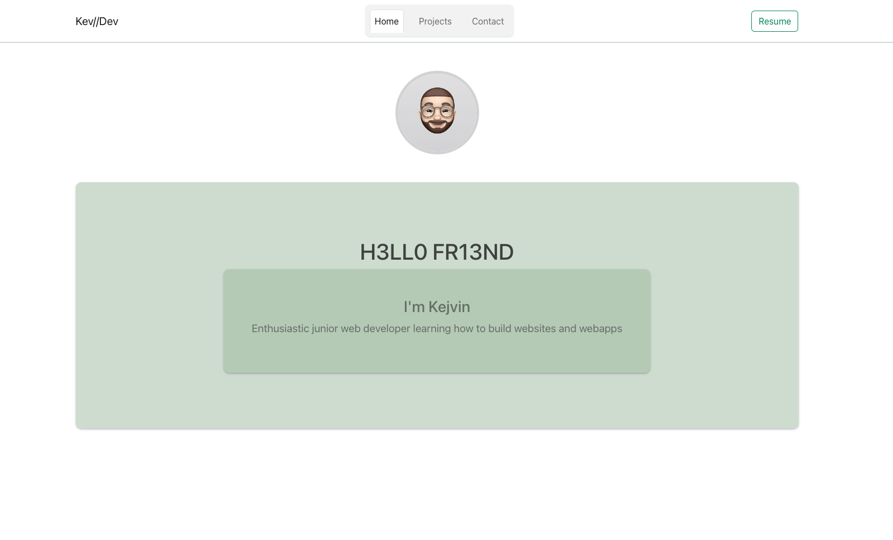
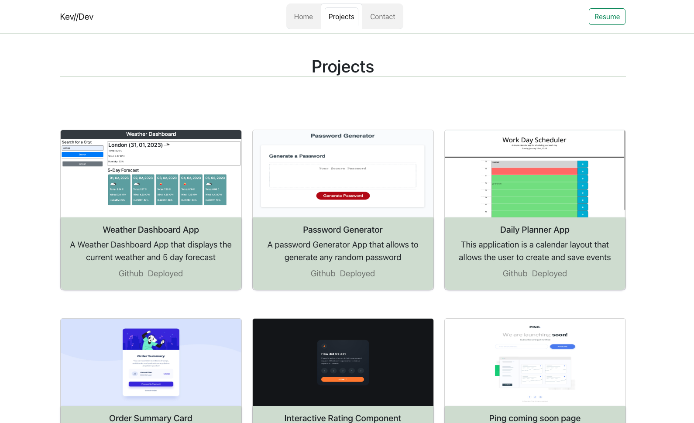
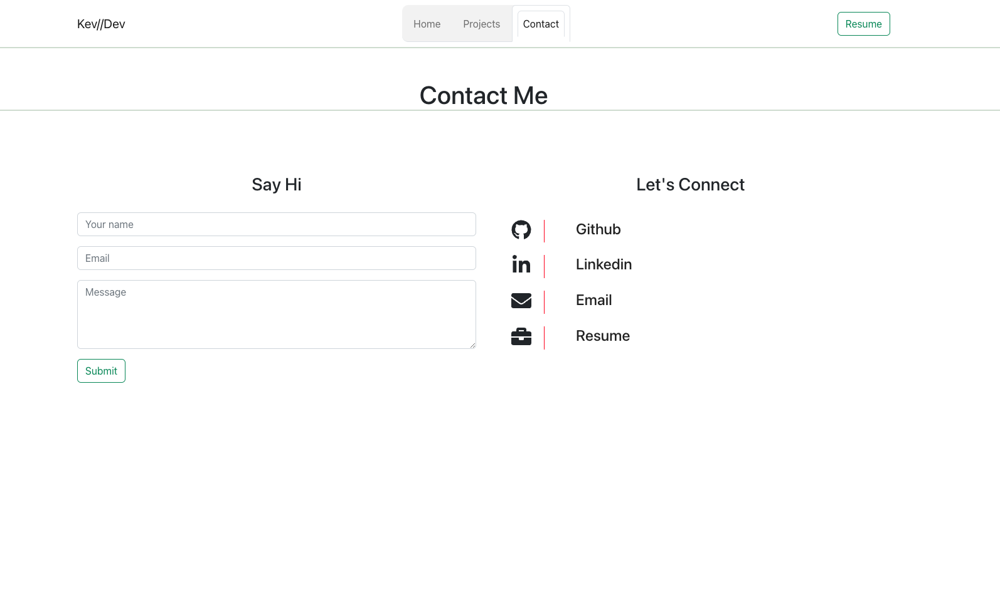
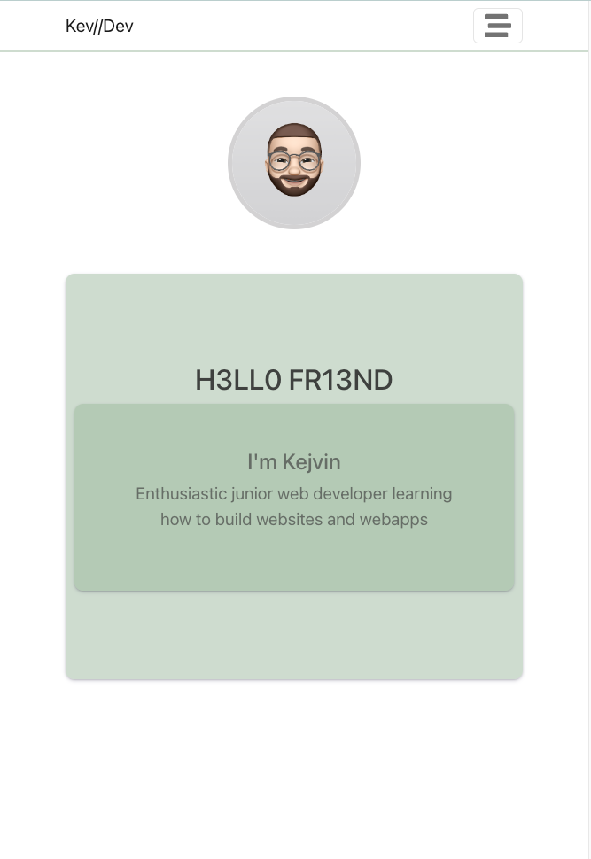
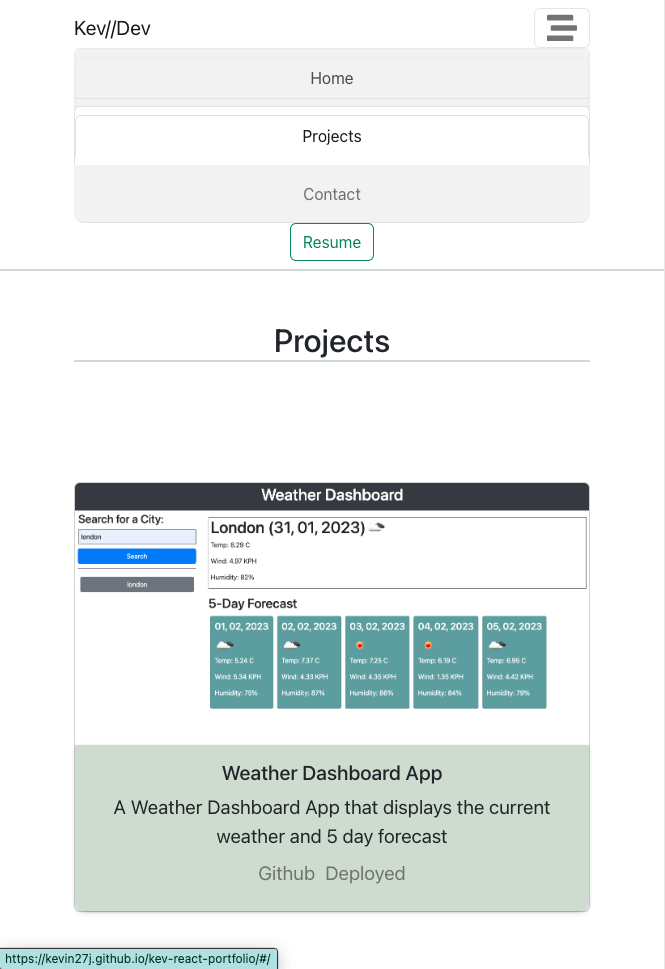
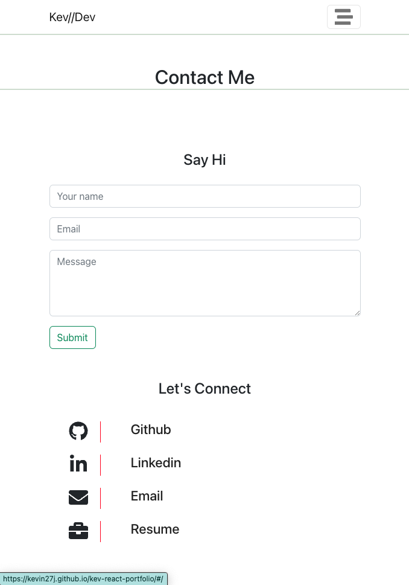

# React Portfolio Kejvin


## Description

This is my single-page React built portfolio. Here I will share some of my projects and also my contact details.

## Table of Contents
        
- [React Portfolio Kejvin](#react-portfolio-kejvin)
  - [Description](#description)
  - [Table of Contents](#table-of-contents)
  - [Screenshots](#screenshots)
  - [Built with](#built-with)
  - [Installation](#installation)
  - [License](#license)
  - [Links](#links)
  - [Author](#author)

## Screenshots








## Built with

- HTML
- CSS
- Javascript
- React

## Installation

To install necessary dependencies, run the following command:

```
npm install
```

## License

This project is licensed under the MIT license

## Links

[Github](https://github.com/Kevin27j/kev-react-portfolio)
[Live Site](https://kevin27j.github.io/kev-react-portfolio/)

## Author

[Kevin27j](https://github.com/Kevin27j)
